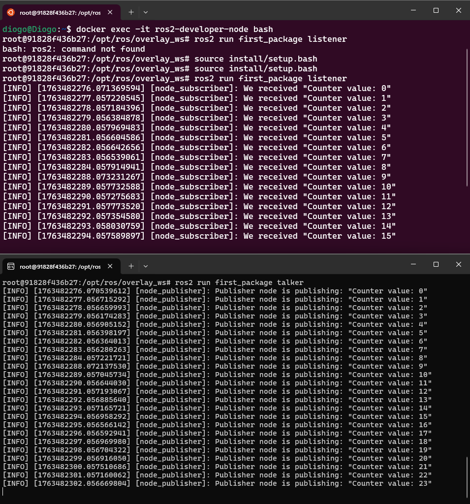

# Ambiente de Simulação Robótica (Turtlebot 4) e Desenvolvimento ROS 2

Este repositório contém um ambiente profissional de desenvolvimento baseado em **Docker**, configurado com:
* **ROS 2 Humble**
* **Gazebo Harmonic** (Simulador de física avançado)
* **Turtlebot 4 Desktop** (Compilado da fonte)

Além da infraestrutura, o projeto contém um pacote de exemplo (`first_package`) demonstrando a comunicação de nós (Pub/Sub) em Python.

## 📂 Estrutura do Projeto
Utilizamos **Docker Volumes** para mapear o código local (`./src`) para dentro do container. Isso permite desenvolver e editar o código na máquina host e ver o resultado imediato no container, sem necessidade de rebuildar a imagem inteira.

## 🚀 Como Rodar

1. **Subir o Ambiente:**
   O `docker-compose` irá construir a imagem (pode levar alguns minutos devido à compilação do Turtlebot) e iniciar o container com as configurações gráficas e volumes:
   ```bash
   docker-compose up -d

   ## 📸 Galeria de Funcionamento

### 1. Infraestrutura e Compilação
O ambiente é construído de forma automatizada. Abaixo, a confirmação do build do Docker e a preparação do workspace.

| Build do Docker 
|:---:|:---:|
|  | 

---

### 2. Execução e Comunicação (ROS 2)
Demonstração prática da comunicação entre nós (Nodes) utilizando a arquitetura Publisher/Subscriber dentro do container isolado.

 

---

### 3. Simulação Gráfica (Gazebo Harmonic)
O container está configurado para suportar interfaces gráficas (GUI), permitindo a execução do simulador Gazebo e ferramentas como Rviz.

